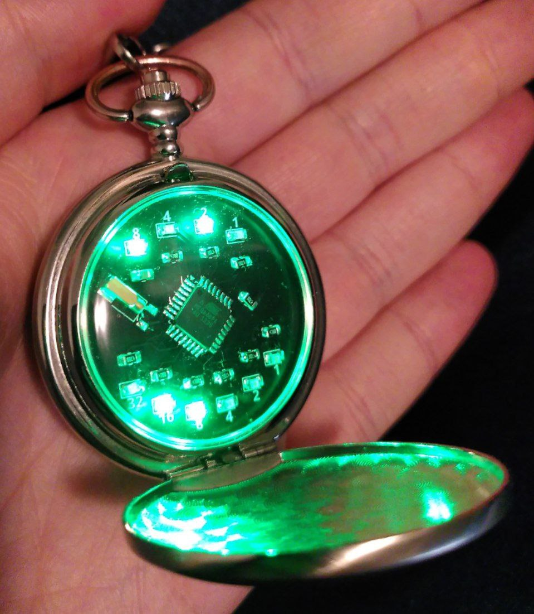

This is a binary pocket watch, made with an atmega48pa. The enclosure is from a cheap pocket watch, mass produced in China and sold via Ebay or Aliexpress.

# how to use the watch

## reading the watch

Open the watch.
The upper four LEDs show the hours in binary, the lower six ones show the minutes. Add the numbers under/over the glowing LEDs to get the current time.
Closing the watch will turn the LEDs off again.

## setting the watch

Press the button for at least 4 seconds (this is called a *long press*). After release the hour LEDs are blinking. Pressing the button for a *short* time will advance the hours. Another long press will enable you to set the minutes in the same way. Pressing the button for a long time in minute setting mode or closing the lid will reset the watch to count and show the time again.

# build your own

Have a look at the [construction manual](construction-manual.md) if you want to build your own.
