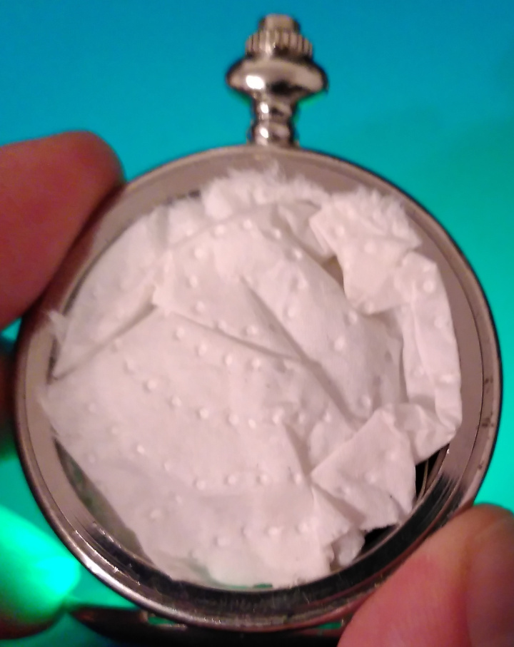

# parts

To solder and assemble the pocket watch, you need

- 1x ATmega48PA in TQFP package
- 1x 100nF capacitor 0805
- 10x 0805 LEDs
- 10x 0805 resistors for the LEDs (I use 470Ω)
- 2x 0805 1MΩ resistors
- 1x 32768Hz quartz, 6pF (I use MS1V-T1K)
- 1x SMD battery holder for a CR3032
- 2x pogo pin
- stiff wire that can be soldered to the PCB
- a pocket watch enclosure
- superglue
- USBASP or similar for flashing
- 1x CR3032 battery
- some paper towel or cloth

# assembly

1. Open the pocket watch and remove the face and the plastic bracket. Keep the button and rod for setting the watch.

2. Cut the threaded part of the rod, only keep the part to push the spring down with the button.

3. Use superglue to attach the button to the enclosure. Make sure, the button still can be pressed.

4. Solder the front side of the PCB.

5. Solder the resistors and the battery holder to the back side of the PCB.

6. Bend a stiff wire and solder it to the smaller pad on the back side. Make sure it makes contact with the spring in the enclosure.

7. Solder the pogo pins to bigger pads on the back of the PCB. Make sure the upper makes contact when the button is pressed and the upper makes contact when the lid is closed.

8. Flash the software to the microcontroller. I use four Dupont wires with a pin header for the small pads and two clips for power and ground.

9. Insert the battery into the PCB. Insert the PCB into the enclosure. Use some paper towel or cloth to keep the PCB in place in the enclosure. Also the battery should *not* make contact with the back of the enclosure.

10. Set time and re-assemble the chain.

